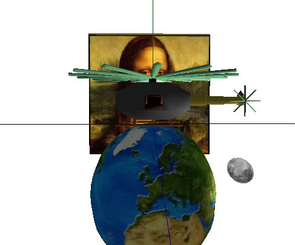
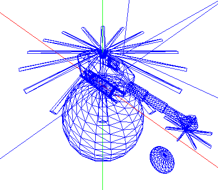
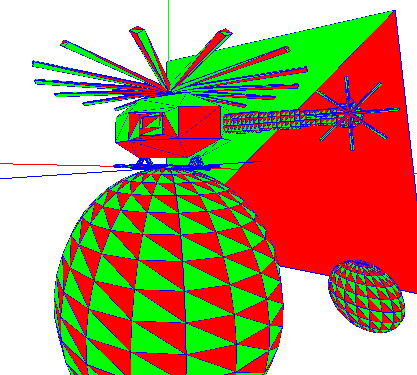
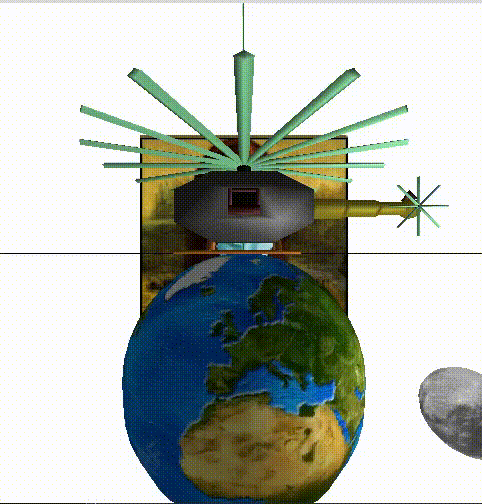

# Computer-Graphics-project
Created with OpenGL as a final project in my computer graphics course at UGR. 

### Wireframe mode

### Cameras
There are 3 cameras placed in the scene, each of them can move in 1st and 3d person and zoom in or out.

### Moving moon
The moon moves around, and so does its light source.

### Helicopter animations

## Credit
JPG library by Chris Losinger.
The main function, the makefile, as well as the skeleton for the Escena class were provided by professor Javier Melero Rus.
